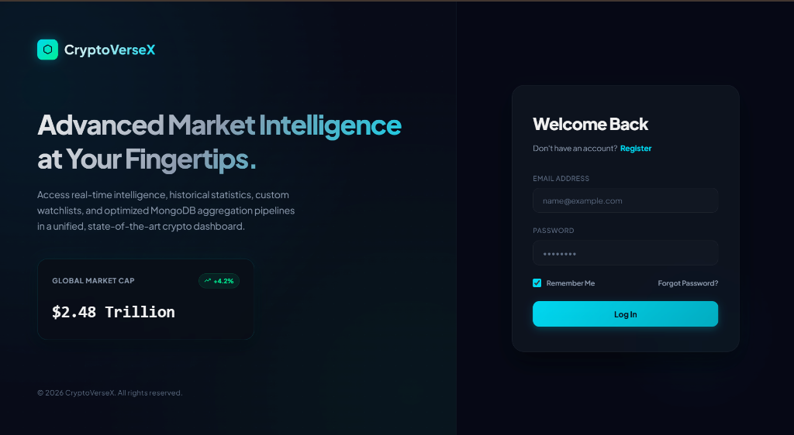
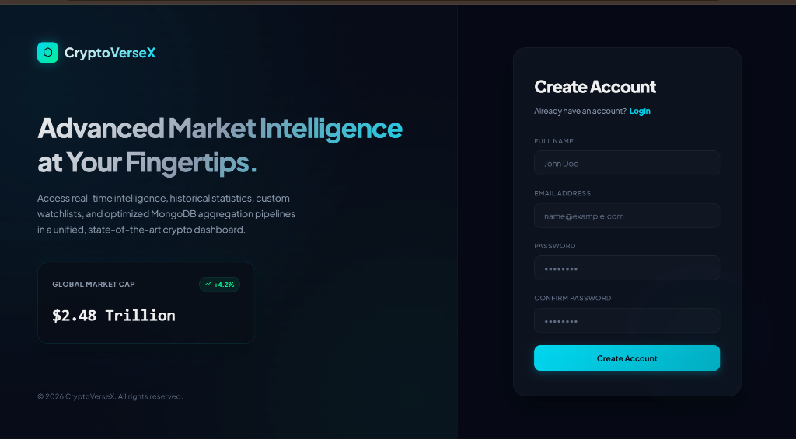
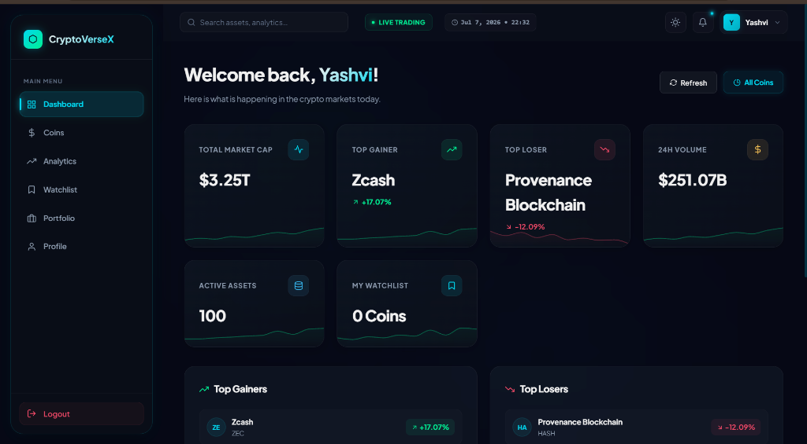
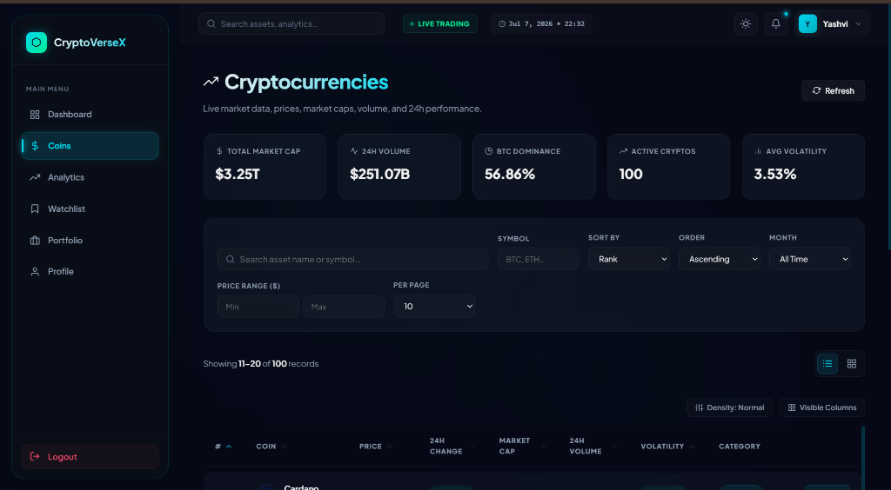
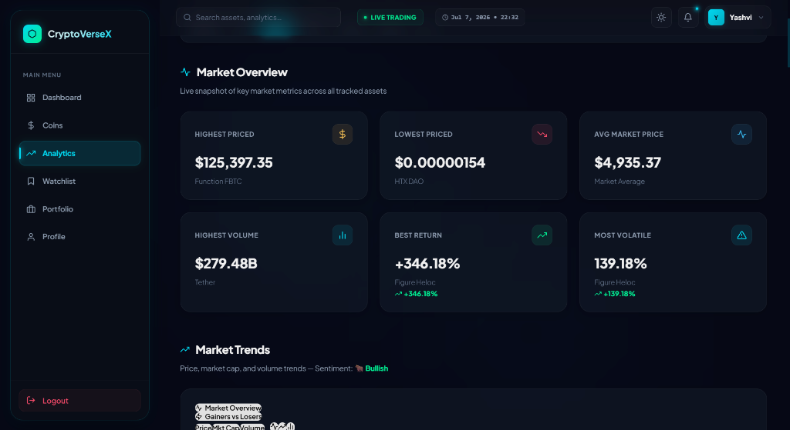

 <div align="center">


# 🚀 CryptoVerseX

[](https://opensource.org/licenses/MIT)
[](https://github.com/ellerbrock/open-source-badges/)
[](https://react.dev/)
[](https://redux-toolkit.js.org/)
[](https://vitejs.dev/)


### *Advanced Cryptocurrency Market Intelligence Platform*

**Enterprise-Grade MERN Stack Crypto Analytics Dashboard** — Real-time cryptocurrency tracking, analytics, portfolio simulation, market intelligence, and historical data insights powered by MongoDB aggregation pipelines.

<br/>

[]()
[]()
[]()
[]()
[]()
[]()

<br/>


</div>

---

# 🔗 Quick Links

| Resource                           | Link        |
| ---------------------------------- | ----------- |
| 🌐 **Live Production App**         | Coming Soon |
| ▲ **Frontend Deployment (Vercel)** | Coming Soon |
| 🚀 **Backend API (Render)**        | Coming Soon |
| 📦 **Frontend Repository**         | Coming Soon |
| 🗄️ **Backend Repository**         | Coming Soon |
| 📬 **Postman Documentation**       | Coming Soon |
| ▶️ **YouTube Demo Video**          | Coming Soon |
| 📄 **API Health Endpoint**         | Coming Soon |
| 📊 **Admin Dashboard Preview**     | Coming Soon |

---

# 📖 About The Project

# Project Overview

**CryptoVerseX** is a complete full-stack cryptocurrency analytics ecosystem built using the **MERN Stack (MongoDB, Express.js, React.js, Node.js)**.

The platform provides:

* 📈 Real-time cryptocurrency market analytics
* 📊 Advanced financial statistics & aggregation pipelines
* 🪙 Historical market tracking
* 🔍 Dynamic filtering, sorting & searching
* 📉 Volatility & return analytics
* 🔐 JWT authentication & role-based access control
* 👨‍💼 Admin & user dashboards
* 📱 Fully responsive UI system
* 🚀 Production-grade backend architecture

The project is built as an **industry-standard enterprise dashboard application** following scalable architecture patterns, optimized MongoDB querying techniques, RESTful API standards, middleware chaining, Redux Toolkit state management, and modern React frontend practices.

---

# 📅 Development Timeline

## ✅ Backend Phase

**13 May 2026 → 28 May 2026 (15 Days)**

Includes:

* MongoDB schema design
* REST API development
* JWT authentication
* Middleware system
* Aggregation pipelines
* Error handling
* Postman testing
* Database seeding
* API optimization

---

## ✅ Frontend Phase

**29 May 2026 → 13 June 2026 (15 Days)**

Includes:

* React dashboard UI
* Backend API integration
* Redux Toolkit implementation
* Authentication flow
* Charts & analytics visualization
* Protected routes
* Admin panel
* Deployment-ready build

---

# 🎬 Project Demo

<div align="center">

[]()

> Full walkthrough and deployment demo coming soon.

</div>

---

# 🧠 Dataset Information

## 📂 Dataset Source

```bash
Google Drive Dataset:
https://drive.google.com/file/d/1Kwz2f4QDRj2AcyaYG87kdnRm3EPfUNaH/view
```

## 📦 Dataset Contains

The dataset contains:

* Cryptocurrency records
* Historical market data
* Market capitalization values
* Daily return percentages
* Volatility metrics
* Trading volume information
* Rank-based market analysis
* Monthly & yearly analytics
* Timestamp-based historical tracking

---

# Tech Stack

# ⚙️ Backend Technologies

| Technology             | Purpose                        |
| ---------------------- | ------------------------------ |
| **Node.js**            | Backend runtime environment    |
| **Express.js**         | REST API framework             |
| **MongoDB Atlas**      | Cloud NoSQL database           |
| **Mongoose ODM**       | MongoDB schema modeling        |
| **JWT**                | Authentication & authorization |
| **bcryptjs**           | Password hashing               |
| **express-validator**  | Input validation               |
| **Helmet.js**          | Security middleware            |
| **Morgan**             | HTTP request logging           |
| **express-rate-limit** | API rate limiting              |
| **dotenv**             | Environment configuration      |
| **Cors**               | Cross-origin handling          |
| **Nodemon**            | Development server             |

---

# 🎨 Frontend Technologies & Dependencies

| Dependency / Tool      | Purpose                                |
| ---------------------- | -------------------------------------- |
| **React 18 + Vite**    | Frontend UI library & build tool       |
| **@reduxjs/toolkit**   | Modern state management logic          |
| **react-redux**        | React bindings for Redux state         |
| **react-router-dom**   | Declarative routing & navigation       |
| **axios**              | HTTP client for backend API queries    |
| **react-hook-form**    | Lightweight & flexible form validation |
| **jwt-decode**         | Decode JWT tokens for user sessions    |
| **react-hot-toast**    | Sleek popup toast notifications        |
| **react-icons**        | Extensive vector icon pack collection  |
| **recharts**           | Modern interactive analytics charts    |

---

# ☁️ Deployment Infrastructure

| Service            | Role                |
| ------------------ | ------------------- |
| **Vercel**         | Frontend deployment |
| **Render**         | Backend deployment  |
| **MongoDB Atlas**  | Cloud database      |
| **GitHub Actions** | CI/CD pipeline      |

---

# Features

# 👤 User Features

* 🔐 JWT Authentication System
* 📈 Real-Time Cryptocurrency Analytics
* 🔍 Smart Search System
* 📊 Dynamic Market Statistics
* 📉 Top Gainers & Losers Tracking
* 💹 Historical Market Charts
* 📚 Portfolio Simulation
* 🌙 Dark / Light Mode
* 📱 Responsive Dashboard Layout
* 🧮 Advanced Filtering System
* 📄 Pagination & Sorting
* 🔔 Toast Notifications
* 👤 User Profile Management
* 🪙 Trending Coins System
* 📊 Personalized Dashboard Analytics

---

# 👨‍💼 Admin Features

* 📊 Admin Analytics Dashboard
* 👥 User Management System
* 🗄️ Coin Data Management
* 📈 Aggregation-Based Reports
* 🔍 Search Analytics
* ⚡ API Monitoring
* 🛡️ Role-Based Access Control
* 📉 Volume & Market Insights
* 🧾 Audit Logging System
* 🚦 Rate Limiting Management

---

# ⚙️ Platform Features

* ⚡ MongoDB Aggregation Pipelines
* 📡 RESTful API Architecture
* 🔐 Secure JWT Authentication
* 🛡️ Middleware Chaining
* 📄 Standardized API Responses
* 🚀 Production-Ready Folder Structure
* 📱 Fully Responsive Design
* 🔎 Advanced Regex Search
* 🧠 Dynamic Query Builder
* 📦 Bulk CRUD Operations
* 📈 Real-Time Market Analytics
* 💾 Database Seeding Scripts

---


# API Integration

The frontend app integrates with the backend through service modules using Axios clients with interceptors.

- **Axios Client**: Defined in `frontend/src/api/apiClient.js` with automatic JWT token attachment in requests, and global status intercepts (e.g. 401 triggers logout) in responses.
- **Service Layer**: Decoupled backend fetch logic located in `frontend/src/services/`:
  - `auth.service.js` (Authentication & Profile)
  - `coin.service.js` (Live Coins, Details, History, Analytics)
  - `watchlist.service.js` (Bookmarked Coins management)
  - `portfolio.service.js` (Virtual portfolios & Simulator calculator)

---

# 📚 Core API Modules

## 🪙 Coin APIs

### CRUD Operations

| Method   | Endpoint     | Description                      |
| -------- | ------------ | -------------------------------- |
| `GET`    | `/coins`     | Fetch all cryptocurrency records |
| `GET`    | `/coins/:id` | Fetch single coin by ID          |
| `POST`   | `/coins`     | Create new cryptocurrency record |
| `PUT`    | `/coins/:id` | Replace complete coin data       |
| `PATCH`  | `/coins/:id` | Partial coin update              |
| `DELETE` | `/coins/:id` | Delete coin record               |

---

## 📈 Analytics APIs

| Method | Endpoint                     | Description           |
| ------ | ---------------------------- | --------------------- |
| `GET`  | `/analytics/price/highest`   | Highest priced coin   |
| `GET`  | `/analytics/price/average`   | Average market price  |
| `GET`  | `/analytics/returns/top`     | Highest return coins  |
| `GET`  | `/analytics/volume/highest`  | Highest traded coins  |
| `GET`  | `/analytics/volatility/high` | High volatility coins |

---

## 🔍 Search APIs

| Method | Endpoint                   | Description         |
| ------ | -------------------------- | ------------------- |
| `GET`  | `/search/coins?q=bitcoin`  | Search by keyword   |
| `GET`  | `/search/coins?q=btc`      | Search by symbol    |
| `GET`  | `/search/coins?q=trending` | Trending searches   |
| `GET`  | `/search/coins?q=history`  | Historical searches |

---

## 🔐 Authentication APIs

| Method  | Endpoint         | Description    |
| ------- | ---------------- | -------------- |
| `POST`  | `/auth/register` | Register user  |
| `POST`  | `/auth/login`    | Login user     |
| `POST`  | `/auth/logout`   | Logout user    |
| `GET`   | `/auth/profile`  | Get profile    |
| `PATCH` | `/auth/profile`  | Update profile |

---

# Project Architecture

For an in-depth breakdown of system components, state flows, and API lifecycles, see the detailed [System Architecture & Workflows](docs/architecture.md) documentation.


```bash
                    ┌──────────────────────┐
                    │       Vercel         │
                    │  React Frontend App  │
                    └──────────┬──────────┘
                               │
                          HTTPS REST
                               │
                    ┌──────────▼──────────┐
                    │       Render         │
                    │  Node.js + Express   │
                    └──────────┬──────────┘
                               │
                        Mongoose ODM
                               │
                    ┌──────────▼──────────┐
                    │    MongoDB Atlas     │
                    │   Cloud NoSQL DB     │
                    └─────────────────────┘
```

---

# Folder Structure

## Backend Folder Structure

```bash
backend/
│
├── src/
│   ├── config/
│   ├── controllers/
│   ├── services/
│   ├── routes/
│   ├── middlewares/
│   ├── models/
│   ├── validators/
│   ├── utils/
│   ├── seed/
│   └── scripts/
│
├── .env
├── package.json
└── server.js
```

---

## Frontend Folder Structure

```bash
frontend/
├── public/
├── src/
│   ├── api/
│   ├── assets/
│   │   ├── images/
│   │   ├── icons/
│   │   └── logos/
│   ├── components/
│   │   ├── common/
│   │   ├── cards/
│   │   ├── charts/
│   │   ├── tables/
│   │   ├── forms/
│   │   └── layout/
│   ├── pages/
│   │   ├── Home/
│   │   ├── Dashboard/
│   │   ├── Coins/
│   │   ├── CoinDetails/
│   │   ├── Analytics/
│   │   ├── Watchlist/
│   │   ├── Login/
│   │   ├── Register/
│   │   └── NotFound/
│   ├── routes/
│   ├── redux/
│   │   ├── slices/
│   │   └── thunks/
│   ├── hooks/
│   ├── utils/
│   ├── constants/
│   ├── context/
│   ├── layouts/
│   ├── services/
│   └── styles/
```

### Folder Explanations

- **`public/`**: Stores static assets accessible directly by the browser (e.g., favicon, manifest, robots.txt).
- **`src/api/`**: Contains API configuration, client setup (e.g., Axios instance), and endpoint definitions.
- **`src/assets/`**: Houses static resources like images, icons, and logos.
- **`src/components/`**: Houses reusable UI components categorized into:
  - `common/`: General, app-wide components (buttons, inputs, loaders, modals).
  - `cards/`: Info cards, statistical cards, coin cards.
  - `charts/`: Chart configurations and wrapper components.
  - `tables/`: Data tables with sorting, filtering, and pagination support.
  - `forms/`: Authentication and search/filter forms.
  - `layout/`: UI structural components (sidebar, navbar, footer).
- **`src/pages/`**: Represents individual pages of the application:
  - `Home/`: Main landing page.
  - `Dashboard/`: Central user/admin analytics board.
  - `Coins/`: Cryptocurrency explorer.
  - `CoinDetails/`: Detailed view for a single cryptocurrency.
  - `Analytics/`: Volatility, return, and advanced market insights page.
  - `Watchlist/`: User's bookmarked or tracked coins list.
  - `Login/`: Authentication login page.
  - `Register/`: Authentication registration page.
  - `NotFound/`: Fallback 404 error page.
- **`src/routes/`**: Defines application routing config and protected route wrappers.
- **`src/redux/`**: Manages global state using Redux Toolkit:
  - `slices/`: Sync and async state slices.
  - `thunks/`: Thunks for async actions and side effects.
- **`src/hooks/`**: Custom React hooks for sharing stateful logic (e.g., useAuth, useFetch).
- **`src/utils/`**: Helper utilities and pure functions.
- **`src/constants/`**: Reusable configurations, static data, action types, or message strings.
- **`src/context/`**: React Context providers (e.g., theme toggle, UI alerts).
- **`src/layouts/`**: Wrappers for different layouts (e.g., dashboard layout, authentication layout).
- **`src/services/`**: External services integration (e.g., formatting utilities, charting helpers).
- **`src/styles/`**: Custom styling, theme variables, or global CSS files.

---

# 🛣️ Frontend Routing Architecture

The application implements a robust, client-side routing structure using `react-router-dom` v6. Routes are grouped logically under layouts and protected using route wrapper architectures.

## 📂 File Structure
- **[AppRoutes.jsx](file:///c:/Users/kanan/OneDrive/Desktop/Crypto-final/crypto_historical_365days_yashvi_kanani/frontend/src/routes/AppRoutes.jsx)**: Central routing configuration connecting layouts, pages, and route wrapper mechanisms.
- **[ProtectedRoute.jsx](file:///c:/Users/kanan/OneDrive/Desktop/Crypto-final/crypto_historical_365days_yashvi_kanani/frontend/src/routes/ProtectedRoute.jsx)**: A wrapper component that validates user authentication state (pre-configured to allow access for now) and redirects unauthenticated users to `/login`.
- **[PublicRoute.jsx](file:///c:/Users/kanan/OneDrive/Desktop/Crypto-final/crypto_historical_365days_yashvi_kanani/frontend/src/routes/PublicRoute.jsx)**: A wrapper component for public authentication views (like Login/Register) that redirects authenticated users to the `/dashboard`.

---

## 🎨 Layouts
The routing tree uses layout wrapping patterns to render views inside shared outer wrappers:
1. **[MainLayout.jsx](file:///c:/Users/kanan/OneDrive/Desktop/Crypto-final/crypto_historical_365days_yashvi_kanani/frontend/src/layouts/MainLayout.jsx)**: The base container layout for normal application flows, utilizing `<Outlet />` to render page components.
2. **[AuthLayout.jsx](file:///c:/Users/kanan/OneDrive/Desktop/Crypto-final/crypto_historical_365days_yashvi_kanani/frontend/src/layouts/AuthLayout.jsx)**: The authentication wrapper layout for login and signup pages.

---

## 🧭 Routes Map

### 🔓 Public Routes
These routes are accessible publicly, or restrict logged-in users away from auth panels:
- `/` — Landing page / Home
- `/login` — Login screen (wrapped in `PublicRoute`)
- `/register` — Sign Up screen (wrapped in `PublicRoute`)

### 🔒 Protected Routes
These routes represent application views that require active authentication (wrapped in `ProtectedRoute`):
- `/dashboard` — Market analytics dashboard
- `/coins` — Cryptocurrency listing table
- `/analytics` — High return & high volatility metrics
- `/stats` — Cryptocurrency statistics page
- `/watchlist` — Bookmarked coins
- `/profile` — User profile details

### ⚡ Dynamic Routes
- `/coins/:id` — Details view for a specific cryptocurrency, where `:id` represents the dynamic coin ID parameter.

### 🚫 404 Error Handling
- `/not-found` — Explicit 404 page
- `/*` — Fallback catch-all route that automatically redirects unmatched paths to `/not-found`.

---

# 🧮 Frontend Redux State Management Architecture

The application implements a central state management architecture using **Redux Toolkit** (`@reduxjs/toolkit` and `react-redux`). All state slices are registered and configured inside a single global store.

## 📂 File Structure
- **[store.js](file:///c:/Users/kanan/OneDrive/Desktop/Crypto-final/crypto_historical_365days_yashvi_kanani/frontend/src/redux/store.js)**: Central store configuration combining all slice reducers.
- **[authSlice.js](file:///c:/Users/kanan/OneDrive/Desktop/Crypto-final/crypto_historical_365days_yashvi_kanani/frontend/src/redux/slices/authSlice.js)**: Authentication state, user details, and tokens.
- **[coinSlice.js](file:///c:/Users/kanan/OneDrive/Desktop/Crypto-final/crypto_historical_365days_yashvi_kanani/frontend/src/redux/slices/coinSlice.js)**: Selected coin details and loaded cryptocurrencies data lists.
- **[analyticsSlice.js](file:///c:/Users/kanan/OneDrive/Desktop/Crypto-final/crypto_historical_365days_yashvi_kanani/frontend/src/redux/slices/analyticsSlice.js)**: Aggregated market return and volatility metrics state.
- **[watchlistSlice.js](file:///c:/Users/kanan/OneDrive/Desktop/Crypto-final/crypto_historical_365days_yashvi_kanani/frontend/src/redux/slices/watchlistSlice.js)**: User bookmarked coin watchlists state.
- **[uiSlice.js](file:///c:/Users/kanan/OneDrive/Desktop/Crypto-final/crypto_historical_365days_yashvi_kanani/frontend/src/redux/slices/uiSlice.js)**: App-wide layout states (sidebar toggles, themes).

---

## ⚙️ Store Configuration & Provider Connect
The application is wrapped with the Redux `<Provider>` inside [main.jsx](file:///c:/Users/kanan/OneDrive/Desktop/Crypto-final/crypto_historical_365days_yashvi_kanani/frontend/src/main.jsx) to make the store globally available to all React components:
```javascript
import { Provider } from 'react-redux';
import store from './redux/store';

ReactDOM.createRoot(document.getElementById('root')).render(
  <Provider store={store}>
    <App />
  </Provider>
);
```

---

## 🗃️ State Structures & Reducers Map

### 1. Authentication (`auth`)
* **State Structure:**
  ```json
  {
    "user": null,
    "token": null,
    "isAuthenticated": false,
    "loading": false,
    "error": null
  }
  ```
* **Actions:** `setUser`, `logout`, `setLoading`, `setError`

### 2. Coins (`coins`)
* **State Structure:**
  ```json
  {
    "coins": [],
    "selectedCoin": null,
    "loading": false,
    "error": null
  }
  ```
* **Actions:** `setCoins`, `setSelectedCoin`, `setLoading`, `setError`

### 3. Analytics (`analytics`)
* **State Structure:**
  ```json
  {
    "analyticsData": null,
    "marketSummary": null,
    "topGainers": [],
    "topLosers": [],
    "loading": false,
    "error": null,
    "selectedRange": "30"
  }
  ```
* **Actions:** `fetchStart`, `fetchSuccess`, `fetchFailure`, `setSelectedRange`, `resetAnalyticsState`

### 4. Watchlist (`watchlist`)
* **State Structure:**
  ```json
  {
    "watchlist": [],
    "loading": false,
    "error": null
  }
  ```
* **Actions:** `addToWatchlist`, `removeFromWatchlist`, `setLoading`, `setError`

### 5. UI State (`ui`)
* **State Structure:**
  ```json
  {
    "sidebarOpen": false,
    "theme": "light"
  }
  ```
* **Actions:** `toggleSidebar`, `changeTheme`

---

# 🏛️ Dashboard Layout System

The application features a responsive, premium, themeable dashboard layout system implemented entirely via vanilla CSS.

## 🎨 Theme Tokens & Custom Properties
Colors, backgrounds, cards, and input controls adapt automatically when a user switches between light and dark modes. The layout defines distinct variables under target states:
* `[data-theme='dark']` / `:root`: Configures rich, deep-slate backgrounds, transparent glassmorphism boundaries, active glows, and light typography.
* `[data-theme='light']`: Adapts components to standard white card backgrounds, soft borders, and dark typography.

## 🧩 Key Structure Elements
The layout system divides responsibilities into key modules:
1. **[MainLayout.jsx](file:///c:/Users/kanan/OneDrive/Desktop/Crypto-final/crypto_historical_365days_yashvi_kanani/frontend/src/layouts/MainLayout.jsx)**: Wires together the layout components and synchronizes the active theme. It listens to the Redux `ui.theme` state and updates the `data-theme` attribute on the root HTML element.
2. **[Sidebar.jsx](file:///c:/Users/kanan/OneDrive/Desktop/Crypto-final/crypto_historical_365days_yashvi_kanani/frontend/src/components/layout/Sidebar.jsx)**: Handles primary navigation links with active route highlighting. It collapses automatically on mobile screens, displaying a dimmed overlay when opened.
3. **[Navbar.jsx](file:///c:/Users/kanan/OneDrive/Desktop/Crypto-final/crypto_historical_365days_yashvi_kanani/frontend/src/components/layout/Navbar.jsx)**: Displays the current page search bar, theme switcher toggle button, alert notifications bell, and user avatar dropdown menu (with Profile and Logout links).

## 🗂️ Grid Layout & Page Shells
* **Dashboard Shell**: Utilizes a highly flexible CSS grid (`.stats-grid`) to display 6 key stat cards (Market Overview, Top Gainers, Top Losers, Market Cap, Volume, Watchlist Summary) that adapt from 4 columns down to 2 columns on tablets, and 1 column on mobile. Features a two-column `.content-grid` for list leaderboards.
* **Component Page Shells**: Sub-route shells (Coins, Analytics, Statistics, Watchlist, Profile) use card frameworks (`.shell-card`) with centered action states and descriptive graphics.

---

# 🪙 Coin Listing Module

The **Coin Listing Module** is the primary, feature-rich view of the platform located at `/coins`. It displays a list of all supported cryptocurrencies with real-time statistics, advanced filtering, multi-column sorting, pagination, and toggleable view modes (Table vs. Grid).

## 🧩 Component Breakdown
1. **[Coins.jsx](file:///c:/Users/kanan/OneDrive/Desktop/Crypto-final/crypto_historical_365days_yashvi_kanani/frontend/src/pages/Coins/Coins.jsx)**: The page orchestrator. It triggers API fetches for both market summary data and coin records, coordinates local/global states, handles search debounce, and switches views.
2. **[MarketSummaryCards.jsx](file:///c:/Users/kanan/OneDrive/Desktop/Crypto-final/crypto_historical_365days_yashvi_kanani/frontend/src/components/coins/MarketSummaryCards.jsx)**: Displays global cryptocurrency market statistics:
   * Total Market Cap, 24h Volume, BTC Dominance, Active Cryptos, and Exchanges count.
   * Percentage change values are styled dynamically with custom micro-animations (green/red indicators).
3. **[CoinFilters.jsx](file:///c:/Users/kanan/OneDrive/Desktop/Crypto-final/crypto_historical_365days_yashvi_kanani/frontend/src/components/coins/CoinFilters.jsx)**: Houses filter inputs:
   * Debounced text search (for names/symbols).
   * Exact symbol match input.
   * Dropdown selector for sort fields (Rank, Price, 24h Change, Market Cap, Volume, Name) and sorting direction (Ascending/Descending).
   * Month selector for historical data slicing.
   * Price range input (Min Price, Max Price).
   * "Per Page" row limits (10, 20, 50, 100).
   * Contextual "Reset Filters" button.
4. **[CoinTable.jsx](file:///c:/Users/kanan/OneDrive/Desktop/Crypto-final/crypto_historical_365days_yashvi_kanani/frontend/src/components/coins/CoinTable.jsx)**: Standard multi-column layout with clickable headers that toggle column-specific sort states dynamically. Includes responsive overflow support.
5. **[CoinCard.jsx](file:///c:/Users/kanan/OneDrive/Desktop/Crypto-final/crypto_historical_365days_yashvi_kanani/frontend/src/components/coins/CoinCard.jsx)**: A grid card layout using CSS glassmorphism, visual borders, hover lift translations, and high-contrast metric layouts.
6. **[LoadingSkeleton.jsx](file:///c:/Users/kanan/OneDrive/Desktop/Crypto-final/crypto_historical_365days_yashvi_kanani/frontend/src/components/coins/LoadingSkeleton.jsx)**: Shimmer placeholders that match the structure of the active view mode (Table rows vs. Grid cards vs. Market summary cards).
7. **[Pagination.jsx](file:///c:/Users/kanan/OneDrive/Desktop/Crypto-final/crypto_historical_365days_yashvi_kanani/frontend/src/components/coins/Pagination.jsx)**: Renders numbered page buttons with smart ellipsis boundaries (`1 ... 4 5 6 ... 15`), absolute page controls (First/Last), and active states.

## 🎨 Stylesheet & CSS tokens
All styles are structured using vanilla CSS in **[coins.css](file:///c:/Users/kanan/OneDrive/Desktop/Crypto-final/crypto_historical_365days_yashvi_kanani/frontend/src/styles/coins.css)**. It utilizes the dashboard's design tokens:
* Glassmorphism backgrounds: `var(--card-bg)`, `backdrop-filter: blur(12px)`.
* Adaptive border glows & hover shifts (`transform: translateY(-3px)`).
* Strict font family stacks and clean table alignments with responsive media breakpoints.

---

# 📊 Coin Details Module

The **Coin Details Module** (accessible via `/coins/:coinId`) serves as the comprehensive analytics and charting interface of the platform, matching the high standards of platforms like CoinMarketCap and TradingView.

## 🧩 Component Breakdown
1. **[CoinDetails.jsx](file:///c:/Users/kanan/OneDrive/Desktop/Crypto-final/crypto_historical_365days_yashvi_kanani/frontend/src/pages/CoinDetails/CoinDetails.jsx)**: Orchestrates page layout, resolves routes, handles concurrent API request dispatches, and handles state selectors.
2. **[CoinHeader.jsx](file:///c:/Users/kanan/OneDrive/Desktop/Crypto-final/crypto_historical_365days_yashvi_kanani/frontend/src/components/coins/CoinHeader.jsx)**: Displays general token metadata (logo initials, name, symbol, rank, price, 24h change indicators) and handles active watchlist status checking/toggling.
3. **[CoinChart.jsx](file:///c:/Users/kanan/OneDrive/Desktop/Crypto-final/crypto_historical_365days_yashvi_kanani/frontend/src/components/coins/CoinChart.jsx)**: Implements interactive, responsive charts using **Recharts**:
   * Toggles between **Area Chart** and **Line Chart** configurations.
   * Tracks **Price**, **Market Cap**, and **Volume** historical trends.
   * Leverages SVG color gradients, custom tooltips, responsive view scaling, and interactive grid styling.
4. **[RangeSelector.jsx](file:///c:/Users/kanan/OneDrive/Desktop/Crypto-final/crypto_historical_365days_yashvi_kanani/frontend/src/components/coins/RangeSelector.jsx)**: Provides quick-zoom filters: `7 Days`, `30 Days`, `90 Days`, `180 Days`, `365 Days`, and `All Time` with synchronous client-side filtering.
5. **[PerformanceCards.jsx](file:///c:/Users/kanan/OneDrive/Desktop/Crypto-final/crypto_historical_365days_yashvi_kanani/frontend/src/components/coins/PerformanceCards.jsx)**: Grid layout presenting 6 metrics: Daily Return, Monthly Return, calculated ROI/Annual Return, Volatility (Risk Assessment), Live Market Cap, and Traded Volume.
6. **[CoinStatistics.jsx](file:///c:/Users/kanan/OneDrive/Desktop/Crypto-final/crypto_historical_365days_yashvi_kanani/frontend/src/components/coins/CoinStatistics.jsx)**: Detailed price/volume stats (timeline averages, highest points, lowest points) and circulating/total supply summaries.
7. **[HistoricalTable.jsx](file:///c:/Users/kanan/OneDrive/Desktop/Crypto-final/crypto_historical_365days_yashvi_kanani/frontend/src/components/coins/HistoricalTable.jsx)**: Chronological lists of historical price records with custom table pagination (10 items per page).
8. **[CoinDetailsSkeleton.jsx](file:///c:/Users/kanan/OneDrive/Desktop/Crypto-final/crypto_historical_365days_yashvi_kanani/frontend/src/components/coins/CoinDetailsSkeleton.jsx)**: Shimmer loader replicating the final page layout block-by-block.
9. **[CoinDetailsErrorState.jsx](file:///c:/Users/kanan/OneDrive/Desktop/Crypto-final/crypto_historical_365days_yashvi_kanani/frontend/src/components/coins/CoinDetailsErrorState.jsx)**: Graceful error fallback containing "Retry loading" and "Back to List" navigation triggers.

## 📡 API Integration & Redux Flow
The page coordinates calls concurrently using `Promise.all` for efficiency, wrapping optional indicators defensively so the core layout still loads if secondary stats are empty:
* `GET /coins/:coinId` - Retreives asset meta.
* `GET /coins/history/:coinId` - Retrieves comprehensive chronological timeline data.
* `GET /coins/performance/:coinId` - Performance tiers.
* `GET /coins/returns/:coinId` - Estimated return summaries.
* `GET /coins/volatility/:coinId` - Volatility metric rates.
* `GET /coins/price/:coinId`, `/coins/market-cap/:coinId`, `/coins/volume/:coinId` - Live granular feeds.

All state transitions, range filters, and view toggles are dispatched to **[coinDetailsSlice.js](file:///c:/Users/kanan/OneDrive/Desktop/Crypto-final/crypto_historical_365days_yashvi_kanani/frontend/src/redux/slices/coinDetailsSlice.js)**:
```js
state: {
  coinDetails: null,
  history: [],
  performance: null,
  returns: null,
  volatility: null,
  loading: false,
  error: null,
  selectedRange: '30',
  chartMode: 'price',
  chartType: 'area'
}
```

## 🎨 Styles & Glassmorphism Design
All layout structures are written in **[coinDetails.css](file:///c:/Users/kanan/OneDrive/Desktop/Crypto-final/crypto_historical_365days_yashvi_kanani/frontend/src/styles/coinDetails.css)**. It leverages glassmorphic panels (`backdrop-filter: blur(16px)`), CSS grid responsive columns (`.performance-grid`), hover states, and transitions.

---

# 📈 Analytics Dashboard Module

The **Analytics Dashboard Module** (accessible via `/analytics`) serves as a premium, feature-rich showcase page. It aggregates comprehensive crypto market intelligence, performance trends, volatility, risk matrices, and smart insights into an interactive interface built with a glassmorphism dark theme.

## 🧩 Component Breakdown
1. **[Analytics.jsx](file:///c:/Users/kanan/OneDrive/Desktop/Crypto-final/crypto_historical_365days_yashvi_kanani/frontend/src/pages/Analytics/Analytics.jsx)**: The page shell and data coordinator. It manages time range filters (`7D`, `30D`, `90D`, `180D`, `365D`, `All`) and dispatches concurrent API queries resilience-checked via `Promise.allSettled`.
2. **[AnalyticsOverview.jsx](file:///c:/Users/kanan/OneDrive/Desktop/Crypto-final/crypto_historical_365days_yashvi_kanani/frontend/src/components/analytics/AnalyticsOverview.jsx)**: A metric overview card grid displaying:
   * Highest Price asset
   * Lowest Price asset
   * Average Market Price
   * Highest Volume asset
   * Highest Returns percentage
   * Highest Volatility index
3. **[MarketTrendChart.jsx](file:///c:/Users/kanan/OneDrive/Desktop/Crypto-final/crypto_historical_365days_yashvi_kanani/frontend/src/components/analytics/MarketTrendChart.jsx)**: An interactive charting interface utilizing **Recharts** supporting:
   * Chart style formats: **Area**, **Line**, and **Bar** charts.
   * Metric view toggles: **Price**, **Market Cap**, and **Volume**.
   * Responsive dimensions with customized SVG styling, gradients, grid coordinates, and tooltips.
4. **[VolumeAnalytics.jsx](file:///c:/Users/kanan/OneDrive/Desktop/Crypto-final/crypto_historical_365days_yashvi_kanani/frontend/src/components/analytics/VolumeAnalytics.jsx)**: Shows trading volume distributions, volume stats cards (highest, lowest, average), and a comparative volume spike bar chart.
5. **[ReturnsAnalytics.jsx](file:///c:/Users/kanan/OneDrive/Desktop/Crypto-final/crypto_historical_365days_yashvi_kanani/frontend/src/components/analytics/ReturnsAnalytics.jsx)**: Highlights positive return leaders and assets experiencing negative returns, along with a cumulative return trajectory chart.
6. **[VolatilityAnalytics.jsx](file:///c:/Users/kanan/OneDrive/Desktop/Crypto-final/crypto_historical_365days_yashvi_kanani/frontend/src/components/analytics/VolatilityAnalytics.jsx)**: A risk analysis dashboard compiling asset volatility rates into a graded risk leaderboard (High, Medium, Low Risk) utilizing animated progression indicators.
7. **[MarketInsights.jsx](file:///c:/Users/kanan/OneDrive/Desktop/Crypto-final/crypto_historical_365days_yashvi_kanani/frontend/src/components/analytics/MarketInsights.jsx)**: Smart panels detailing programmatically-generated market descriptions, trends, alerts, and statistical anomalies based on live API variables.
8. **[LeaderboardTables.jsx](file:///c:/Users/kanan/OneDrive/Desktop/Crypto-final/crypto_historical_365days_yashvi_kanani/frontend/src/components/analytics/LeaderboardTables.jsx)**: Display grid showcasing top 10 gainers and top 10 losers side-by-side with clickable asset references.
9. **[AnalyticsSkeleton.jsx](file:///c:/Users/kanan/OneDrive/Desktop/Crypto-final/crypto_historical_365days_yashvi_kanani/frontend/src/components/analytics/AnalyticsSkeleton.jsx)**: Skeleton layouts mapped to dashboard layouts utilizing shimmer keyframe animations.

## 📡 API Integration & State Architecture
The module integrates 17 distinct REST queries across backend services:
* **Prices**: `GET /analytics/price/highest`, `/analytics/price/lowest`, `/analytics/price/average`, `/analytics/price/trend`, `/analytics/price/growth`, `/analytics/price/drop`
* **Volumes**: `GET /analytics/volume/highest`, `/analytics/volume/lowest`, `/analytics/volume/average`, `/analytics/volume/spike`
* **Returns**: `GET /analytics/returns/top`, `/analytics/returns/negative`, `/analytics/returns/cumulative`
* **Volatility**: `GET /analytics/volatility/high`
* **Global Stats**: `GET /stats/market-summary`, `/stats/top-gainers`, `/stats/top-losers`

Global state updates are managed via `analyticsSlice.js`:
```js
state: {
  analyticsData: null,
  marketSummary: null,
  topGainers: [],
  topLosers: [],
  loading: false,
  error: null,
  selectedRange: '30'
}
```

## 🎨 Styles & Glassmorphism Design
All styles are maintained inside **[analytics.css](file:///c:/Users/kanan/OneDrive/Desktop/Crypto-final/crypto_historical_365days_yashvi_kanani/frontend/src/styles/analytics.css)**. It incorporates a premium glassmorphic visual system (`rgba(255, 255, 255, 0.03)` background and `backdrop-filter: blur(12px)`), responsive sub-layout flexboxes, indicator tags, risk thresholds, and customized chart colors.

---

# 📊 Advanced Statistics Module

The **Advanced Statistics Module** (accessible via `/stats` and `/statistics`) provides a comprehensive overview of global market aggregations, distributions, leaderboards, and periodic historical analyses. It showcases complex MongoDB aggregation pipeline outputs through premium glassmorphic cards, responsive interactive charts, tabular reports, and dynamic mathematical insights.

## 🧩 Component Breakdown
1. **[Stats.jsx](file:///c:/Users/kanan/OneDrive/Desktop/Crypto-final/crypto_historical_365days_yashvi_kanani/frontend/src/pages/Stats/Stats.jsx)**: Orchestrates data loading for 15 distinct backend aggregation queries in parallel using `Promise.allSettled`. Implements error recovery, state synchronization with Redux, and layouts.
2. **[StatisticsOverview.jsx](file:///c:/Users/kanan/OneDrive/Desktop/Crypto-final/crypto_historical_365days_yashvi_kanani/frontend/src/components/statistics/StatisticsOverview.jsx)**: Renders critical KPIs like Total Market Cap, Avg Price/Volume, Total Listed Coins, Top Gainers/Losers, and record highs in a modern, responsive layout.
3. **[DistributionChart.jsx](file:///c:/Users/kanan/OneDrive/Desktop/Crypto-final/crypto_historical_365days_yashvi_kanani/frontend/src/components/statistics/DistributionChart.jsx)**: Reusable rendering layer using Recharts to abstract SVG Pie, Bar, Area, and Line charts with glassmorphic tooltip components.
4. **[StatisticsCharts.jsx](file:///c:/Users/kanan/OneDrive/Desktop/Crypto-final/crypto_historical_365days_yashvi_kanani/frontend/src/components/statistics/StatisticsCharts.jsx)**: Houses distributions for Rank Tiering, Coin Volatility groups, Price distributions, and Periodic Market Trends.
5. **[StatisticsTable.jsx](file:///c:/Users/kanan/OneDrive/Desktop/Crypto-final/crypto_historical_365days_yashvi_kanani/frontend/src/components/statistics/StatisticsTable.jsx)**: Compiles tabbed lists of top volume leaders and dynamic gainers and losers.
6. **[MonthlyReport.jsx](file:///c:/Users/kanan/OneDrive/Desktop/Crypto-final/crypto_historical_365days_yashvi_kanani/frontend/src/components/statistics/MonthlyReport.jsx)**: Identifies monthly performance peaks, average changes, and details trading volume patterns.
7. **[YearlyReport.jsx](file:///c:/Users/kanan/OneDrive/Desktop/Crypto-final/crypto_historical_365days_yashvi_kanani/frontend/src/components/statistics/YearlyReport.jsx)**: Highlights annual performance grids, yearly market ranges, and averages.
8. **[InsightsPanel.jsx](file:///c:/Users/kanan/OneDrive/Desktop/Crypto-final/crypto_historical_365days_yashvi_kanani/frontend/src/components/statistics/InsightsPanel.jsx)**: Computes and formats dynamic analytical insights on volatility distributions, gain-loss counts, and volume trends.
9. **[ExportButtons.jsx](file:///c:/Users/kanan/OneDrive/Desktop/Crypto-final/crypto_historical_365days_yashvi_kanani/frontend/src/components/statistics/ExportButtons.jsx)**: Exposes actions to export aggregated statistical datasets to CSV and JSON formats.
10. **[StatisticsSkeleton.jsx](file:///c:/Users/kanan/OneDrive/Desktop/Crypto-final/crypto_historical_365days_yashvi_kanani/frontend/src/components/statistics/StatisticsSkeleton.jsx)**: Renders layout placeholders during concurrent load operations.

## 📡 API Integration & State Architecture
The module integrates 15 distinct endpoints on the `/stats` namespace:
* **Market Aggregations**: `GET /stats/market-cap`, `/stats/average-price`, `/stats/average-volume`, `/stats/highest-market-cap`, `/stats/highest-volume`, `/stats/coin-count`, `/stats/market-summary`
* **Performance Leaderboards**: `GET /stats/top-gainers`, `/stats/top-losers`
* **Stat Distributions**: `GET /stats/rank-distribution`, `/stats/price-distribution`, `/stats/volatility-distribution`
* **Periodic Reports**: `GET /stats/monthly-analysis`, `/stats/daily-analysis`, `/stats/yearly-analysis`

Global stats state is synchronized via `statisticsSlice.js`:
```js
state: {
  marketStats: null,
  monthlyStats: null,
  yearlyStats: null,
  distributionStats: null,
  loading: false,
  error: null
}
```

## 🎨 Styles & Glassmorphism Design
All visual styling is maintained in **[statistics.css](file:///c:/Users/kanan/OneDrive/Desktop/Crypto-final/crypto_historical_365days_yashvi_kanani/frontend/src/styles/statistics.css)**. It defines dark glass boundaries (`backdrop-filter: blur(12px)`), responsive sub-layout grid structures, table padding, colored badges indicating gainer/loser percentages, custom dashboard cards, and tooltip layouts.


---

# 💼 Portfolio Simulator & Investment Analytics Module

The **Portfolio Simulator Module** (accessible via `/portfolio`) provides a complete, feature-rich interface to track cryptocurrency assets, analyze allocations, and simulate historical investment returns. It replicates the functionality of popular platforms like CoinMarketCap and Binance Portfolio.

## 🧩 Component Breakdown
1. **[Portfolio.jsx](file:///c:/Users/kanan/OneDrive/Desktop/Crypto-final/crypto_historical_365days_yashvi_kanani/frontend/src/pages/Portfolio/Portfolio.jsx)**: Page orchestrator coordinates data fetches across 6 parallel endpoints using `Promise.allSettled` and manages add/edit/delete actions.
2. **[PortfolioOverview.jsx](file:///c:/Users/kanan/OneDrive/Desktop/Crypto-final/crypto_historical_365days_yashvi_kanani/frontend/src/components/portfolio/PortfolioOverview.jsx)**: Highlights key metrics (Total Investment, Current Value, Profit/Loss, ROI, Best/Worst performing assets).
3. **[PortfolioTable.jsx](file:///c:/Users/kanan/OneDrive/Desktop/Crypto-final/crypto_historical_365days_yashvi_kanani/frontend/src/components/portfolio/PortfolioTable.jsx)**: Lists user transactions with actions to add, edit holdings, and remove coins, with integrated modal forms.
4. **[PortfolioAllocation.jsx](file:///c:/Users/kanan/OneDrive/Desktop/Crypto-final/crypto_historical_365days_yashvi_kanani/frontend/src/components/portfolio/PortfolioAllocation.jsx)**: Renders a Recharts Pie Chart representing asset distributions.
5. **[PortfolioCharts.jsx](file:///c:/Users/kanan/OneDrive/Desktop/Crypto-final/crypto_historical_365days_yashvi_kanani/frontend/src/components/portfolio/PortfolioCharts.jsx)**: Displays portfolio growth timeline and monthly net profit/loss trends.
6. **[InvestmentCalculator.jsx](file:///c:/Users/kanan/OneDrive/Desktop/Crypto-final/crypto_historical_365days_yashvi_kanani/frontend/src/components/portfolio/InvestmentCalculator.jsx)**: Simulates past purchases by looking up historical database prices to output tokens bought, ROI, and growth rate.
7. **[PortfolioSimulator.jsx](file:///c:/Users/kanan/OneDrive/Desktop/Crypto-final/crypto_historical_365days_yashvi_kanani/frontend/src/components/portfolio/PortfolioSimulator.jsx)**: Simulates hypothetical multi-asset performance using the backend simulation endpoints.
8. **[RecommendationsPanel.jsx](file:///c:/Users/kanan/OneDrive/Desktop/Crypto-final/crypto_historical_365days_yashvi_kanani/frontend/src/components/portfolio/RecommendationsPanel.jsx)**: Highlights suggested assets with risk indicators and expected growth prospects.

## 📡 API Integration & State Architecture
The module integrates 6 endpoints from the coin and portfolio namespaces:
* **Holdings**: `GET /portfolio`, `POST /portfolio`, `PATCH /portfolio/:id`, `DELETE /portfolio/:id`
* **Analytics**: `GET /portfolio/dashboard/overview`, `GET /portfolio/analytics/summary`, `GET /portfolio/analytics/distribution`, `GET /portfolio/analytics/history`
* **External Engines**: `GET /coins/recommendations`, `GET /coins/portfolio/simulate`

Global state is synchronized via `portfolioSlice.js`:
```js
state: {
  portfolio: null,
  holdings: [],
  simulationResults: null,
  recommendations: [],
  loading: false,
  error: null
}
```

## 🎨 Styles & Glassmorphism Design
All visual styling is maintained in **[portfolio.css](file:///c:/Users/kanan/OneDrive/Desktop/Crypto-final/crypto_historical_365days_yashvi_kanani/frontend/src/styles/portfolio.css)**. It features deep-dark glassmorphism, responsive flex/grid layouts, interactive charts, colored trend indicators, and full-screen overlays.

---

# 📌 Watchlist & Bookmark Management Module

The **Watchlist & Bookmark Management Module** (accessible via `/watchlist`) provides a complete user-centric asset tracking system. Users can save, categorize, annotate, and monitor bookmarked cryptocurrencies with real-time price comparison, global trending insights, and personal portfolio analytics.

## 🧩 Component Breakdown
1. **[Watchlist.jsx](file:///c:/Users/kanan/OneDrive/Desktop/Crypto-final/crypto_historical_365days_yashvi_kanani/frontend/src/pages/Watchlist/Watchlist.jsx)**: Page orchestrator that fetches bookmarks, analytics, and trending data in parallel using `Promise.allSettled`. Manages filter overlays, modal triggers, optimistic deletes, and empty state UI.
2. **[BookmarkButton.jsx](file:///c:/Users/kanan/OneDrive/Desktop/Crypto-final/crypto_historical_365days_yashvi_kanani/frontend/src/components/watchlist/BookmarkButton.jsx)**: Reusable heart-shaped toggle icon supporting optimistic state updates (instant UI feedback before API confirmation) and error rollback. Integrated into the Coin Details header.
3. **[BookmarkModal.jsx](file:///c:/Users/kanan/OneDrive/Desktop/Crypto-final/crypto_historical_365days_yashvi_kanani/frontend/src/components/watchlist/BookmarkModal.jsx)**: Modal form for assigning/updating a bookmark's category (Long Term, Short Term, Research, High Risk, Favorites, or Custom) and personal notes. Uses optimistic Redux dispatch on save.
4. **[WatchlistFilters.jsx](file:///c:/Users/kanan/OneDrive/Desktop/Crypto-final/crypto_historical_365days_yashvi_kanani/frontend/src/components/watchlist/WatchlistFilters.jsx)**: Filter control bar featuring debounced search (300ms), category dropdown, sort field/order selectors, and a grid/table view toggle.
5. **[WatchlistTable.jsx](file:///c:/Users/kanan/OneDrive/Desktop/Crypto-final/crypto_historical_365days_yashvi_kanani/frontend/src/components/watchlist/WatchlistTable.jsx)**: Full tabular display with columns for Coin, Symbol, Added Price, Current Price, Return %, Category badge, Notes, Date Added, and quick Edit/Delete actions.
6. **[WatchlistCard.jsx](file:///c:/Users/kanan/OneDrive/Desktop/Crypto-final/crypto_historical_365days_yashvi_kanani/frontend/src/components/watchlist/WatchlistCard.jsx)**: Grid card view for bookmarked coins, showing identity, price comparison, profit/loss indicator, notes, and footer actions.
7. **[AnalyticsCards.jsx](file:///c:/Users/kanan/OneDrive/Desktop/Crypto-final/crypto_historical_365days_yashvi_kanani/frontend/src/components/watchlist/AnalyticsCards.jsx)**: Overview metrics grid displaying Total Bookmarked Coins, Highest Market Cap asset, Highest Profit Potential coin, Most Recent Bookmark, and Global Top Saved coin.
8. **[TrendingBookmarks.jsx](file:///c:/Users/kanan/OneDrive/Desktop/Crypto-final/crypto_historical_365days_yashvi_kanani/frontend/src/components/watchlist/TrendingBookmarks.jsx)**: Leaderboard of the top 10 globally most-bookmarked coins across all users, with per-coin watch counts and live price data.
9. **[WatchlistSkeleton.jsx](file:///c:/Users/kanan/OneDrive/Desktop/Crypto-final/crypto_historical_365days_yashvi_kanani/frontend/src/components/watchlist/WatchlistSkeleton.jsx)**: Shimmer skeleton layouts matching the analytics cards, filter bar, and main content areas.

## 📡 API Integration & State Architecture
The module integrates 8 backend bookmark REST endpoints:
* **Bookmark CRUD**: `POST /bookmarks/:coinId`, `GET /bookmarks`, `GET /bookmarks/:id`, `PATCH /bookmarks/:id`, `DELETE /bookmarks/:id`
* **Status Check**: `GET /bookmarks/check/:coinId`
* **Analytics**: `GET /bookmarks/analytics/summary`
* **Trending**: `GET /bookmarks/trending`

Global watchlist state is managed via `watchlistSlice.js`:
```js
state: {
  bookmarks: [],
  bookmarkAnalytics: null,
  trendingBookmarks: [],
  loading: false,
  error: null,
  viewMode: 'table',
  filters: {
    category: '',
    search: '',
    sortBy: 'createdAt',
    sortOrder: 'desc',
    minPrice: '',
    maxPrice: '',
    symbol: ''
  },
  pagination: { page: 1, limit: 10, total: 0, totalPages: 0 }
}
```

## 🎨 Styles & Glassmorphism Design
All visual styling is defined in **[watchlist.css](file:///c:/Users/kanan/OneDrive/Desktop/Crypto-final/crypto_historical_365days_yashvi_kanani/frontend/src/styles/watchlist.css)**. Features include: analytics card grids with hover elevation, responsive filter bars, table/card dual-view layouts, animated category badges per type, heart-button pulse animations, a glassmorphic modal with slide-up entry, shimmer skeletons, and full mobile responsiveness.

---

# 🗄 MongoDB Schema Design

## 🪙 Coin Schema

```js
const coinSchema = new mongoose.Schema({
  coinId: {
    type: String,
    required: true,
    unique: true,
  },
  name: {
    type: String,
    required: true,
    index: true,
  },
  symbol: {
    type: String,
    required: true,
    uppercase: true,
  },
  rank: {
    type: Number,
    required: true,
  },
  price: {
    type: Number,
    required: true,
  },
  marketCap: {
    type: Number,
    required: true,
    index: true,
  },
  volume: {
    type: Number,
    required: true,
  },
  dailyReturn: {
    type: Number,
    default: 0,
  },
  volatility: {
    type: Number,
    default: 0,
  },
  month: {
    type: String,
    required: true,
  },
  timestamp: {
    type: Date,
    default: Date.now,
  },
}, {
  timestamps: true,
});
```

---

# 🔐 JWT Authentication Flow

```bash
Register User
   ↓
Validate Inputs
   ↓
Hash Password (bcryptjs)
   ↓
Store User in MongoDB
   ↓
Generate JWT Token
   ↓
Return Token to Frontend
   ↓
Store Token in localStorage
   ↓
Access Protected Routes
```

---

# 🔄 Middleware Chaining

```bash
Request
   ↓
Logger Middleware
   ↓
Helmet Security
   ↓
CORS Validation
   ↓
Rate Limiting
   ↓
Authentication Middleware
   ↓
Validation Middleware
   ↓
Controller
   ↓
Response
```

---

# ⚡ Advanced MongoDB Features

## Aggregation Pipelines

Implemented:

* `$match`
* `$group`
* `$project`
* `$sort`
* `$lookup`
* `$facet`
* `$limit`
* `$skip`

### Example Aggregation

```js
const topCoins = await Coin.aggregate([
  {
    $match: {
      marketCap: { $gt: 1000000 },
    },
  },
  {
    $sort: {
      marketCap: -1,
    },
  },
  {
    $limit: 10,
  },
]);
```

---

# 📊 Frontend Dashboard Modules

## 👨‍💼 Admin Dashboard

* Analytics Overview
* User Management
* Coin Management
* API Statistics
* Search Monitoring
* System Health Monitoring

---

## 👤 User Dashboard

* Market Overview
* Trending Coins
* Portfolio Simulation
* Coin Analytics
* Search & Filters
* Profile Management

---

# 📈 Analytics Dashboard Features

* 📊 Total Market Capitalization
* 📈 Average Trading Volume
* 📉 Market Volatility Charts
* 💹 Top Performing Coins
* 📊 Monthly Growth Analytics
* 🪙 Trending Cryptocurrency Analysis
* 📉 Daily Return Tracking
* 📈 Real-Time Dashboard Metrics

---

# 🧮 Redux Toolkit State Management

## Redux Slices

| Slice            | Purpose                 |
| ---------------- | ----------------------- |
| `authSlice`      | Authentication handling |
| `coinSlice`      | Cryptocurrency data     |
| `analyticsSlice` | Analytics state         |
| `userSlice`      | User information        |
| `uiSlice`        | Theme & notifications   |

---

# 📱 Responsive UI Features

* Desktop Dashboard Layout
* Tablet Responsive Design
* Mobile Optimized Components
* Sidebar Navigation
* Top Navbar System
* Charts & Cards Layout
* Skeleton Loaders
* Error States
* Empty States
* Toast Notifications

---

# Installation Guide

## 📥 Clone Repository

```bash
git clone https://github.com/your-username/cryptoversex.git
```

```bash
cd cryptoversex
```

---

# Environment Variables

# Environment Variables

### Backend Environment Variables
Create a `.env` file in the `backend/` directory:
```env
PORT=5000
MONGO_URI=mongodb+srv://<username>:<password>@cluster0.mongodb.net/cryptoversex?retryWrites=true&w=majority
JWT_SECRET=your_super_secret_jwt_key_here
JWT_EXPIRES_IN=7d
NODE_ENV=development
CLIENT_URL=http://localhost:5173
```

### Frontend Environment Variables
Create a `.env` file in the `frontend/` directory:
```env
VITE_API_BASE_URL=http://localhost:5000/api/v1
```

---

# ⚙️ Backend Setup

```bash
cd backend
npm install
```

Create `.env`

```env
PORT=5000
MONGO_URI=your_mongodb_uri
JWT_SECRET=your_secret_key
JWT_EXPIRES_IN=7d
NODE_ENV=development
CLIENT_URL=http://localhost:5173
```

Run backend:

```bash
npm run dev
```

Backend URL:

```bash
http://localhost:5000
```

---

# 🎨 Frontend Setup

### 1. Navigate to the Frontend Directory
```bash
cd frontend
```

### 2. Install Dependencies
```bash
npm install
```

### 3. Environment Variable Configuration
Create a `.env` file in the `frontend` folder (you can copy `.env.example` as a starting template):
```bash
cp .env.example .env
```
Set the API base URL parameter:
```env
VITE_API_BASE_URL=your_api_production_url/api/v1
```

### 4. Run the Development Server
```bash
npm run dev
```

Once started, the development server is available at:
- **Local url**: [http://localhost:5173](http://localhost:5173)

### 5. Build and Preview for Production
To build the static application bundle:
```bash
npm run build
```
To preview the production build locally:
```bash
npm run preview
```

---

# 🌐 Deployment Guide

## ▲ Frontend Deployment (Vercel)

```bash
npm i -g vercel
vercel --prod
```

---

## 🚀 Backend Deployment (Render)

1. Push backend repository to GitHub
2. Open Render Dashboard
3. Create Web Service
4. Connect repository
5. Add environment variables
6. Deploy backend server

---

# 🔒 Security Features

* JWT Authentication
* Password Hashing using bcryptjs
* Rate Limiting
* Helmet Security Headers
* Role-Based Access Control
* Secure API Middleware
* Validation Layer
* Environment Variable Protection
* Global Error Handling

---

# Performance Optimizations

* MongoDB Indexing
* Optimized Queries
* Aggregation Pipelines
* Pagination System
* Lazy Loading
* Code Splitting
* Redux Optimization
* API Caching Strategy

---

# 📚 SEO Features

* Dynamic Meta Tags
* Open Graph Support
* Structured Data
* Sitemap.xml
* React Helmet Integration
* Google Search Console Ready

---

# 📦 Scripts

## Backend Scripts

```bash
npm run dev
npm run start
npm run seed
```

## Frontend Scripts

```bash
npm run dev
npm run build
npm run preview
```

---

# 🧪 API Testing

## Tools Used

| Tool            | Purpose             |
| --------------- | ------------------- |
| Postman         | API testing         |
| MongoDB Compass | Database inspection |
| Thunder Client  | API debugging       |

---

# 📸 Application Screenshots

This section showcases the redesigned user interface of CryptoVerseX. All images are hosted locally inside the frontend assets directory.

## Login Screen

The redesigned Login screen features a futuristic split-panel layout, combining a holographic visual grid on the left with a polished glassmorphism login form on the right.



## Register Screen

A matching split-panel sign-up interface that provides interactive validation checks and a seamless entry flow.



## Dashboard

The central command center of the application, featuring glowing KPI cards with integrated Recharts sparkline overlays showing price trends.



## Coins

The coin directory provides a tabular overview with custom density selection (Normal, Spacious, Compact), dynamic column visibility controls, sorting, and pagination.



## Analytics

A deep-dive analytics dashboard featuring TradingView-style interactive trend charts with custom glowing neon tooltips and gainers/losers leaderboard widgets.



## Watchlist

A personalized list allowing users to monitor specific digital assets with real-time analytics updates.

## Portfolio

An interactive portfolio simulator that tracks coin values and simulates investment growth over custom time frames.

## Profile

Manage security preferences, view the developer status, and track JWT session timestamps and account logs via an interactive timeline.


---

# Future Enhancements

* AI-Based Market Prediction
* Real-Time WebSocket Prices
* Mobile Application
* Docker Containerization
* Kubernetes Deployment
* Multi-Language Support
* Advanced Portfolio Analytics
* Crypto News Integration
* Web3 Wallet Integration

---

# 🤝 Contribution Guide

```bash
1. Fork Repository
2. Create Feature Branch
3. Commit Changes
4. Push Branch
5. Open Pull Request
```

Commit Convention:

```bash
feat | fix | docs | refactor | chore | test
```

---

# 🔐 Authentication Module

The frontend implements a complete, production-grade authentication system with form validation, JWT session management, Redux state integration, route protection, and session persistence.

## 🖥️ Auth Pages

### Login Page (`src/pages/Login/Login.jsx`)
- **Form Validation** via `react-hook-form`: email format, password minimum 6 chars
- **Remember Me**: persists email in `localStorage` across sessions
- **JWT Token Storage**: token stored to `localStorage` on successful login
- **Redux Integration**: dispatches `setUser`, `setLoading`, `setError`
- **Toast Notifications**: success/error pop-ups via `react-hot-toast`
- **Auto-redirect**: navigates to `/dashboard` on login

### Register Page (`src/pages/Register/Register.jsx`)
- **Form Validation** via `react-hook-form`: name required, email format, password min 6, confirm password must match
- **Auto-login**: user is logged in immediately after successful registration
- **Redux Integration**: dispatches `setUser`, `setLoading`, `setError`
- **Toast Notifications**: success/error pop-ups via `react-hot-toast`
- **Auto-redirect**: navigates to `/dashboard` on account creation

---

## 🔄 Authentication Flow

### Login Flow
```
User enters email + password
     ↓
react-hook-form validation
     ↓
authService.login() → POST /api/v1/auth/login
     ↓
Receives { user, token } from API
     ↓
Stores token in localStorage
     ↓
Dispatches setUser({ user, token }) to Redux
     ↓
Shows success toast → Redirects to /dashboard
```

### Register Flow
```
User enters name, email, password, confirm password
     ↓
react-hook-form validation + password match check
     ↓
authService.register() → POST /api/v1/auth/register
     ↓
Receives { user, token } from API
     ↓
Stores token in localStorage
     ↓
Dispatches setUser({ user, token }) to Redux
     ↓
Shows success toast → Redirects to /dashboard
```

### Logout Flow
```
User clicks Logout
     ↓
authService.logout() → POST /api/v1/auth/logout
     ↓
localStorage.removeItem('token')
     ↓
Dispatches logout() to Redux
     ↓
Shows success toast → Redirects to /login
```

---

## 🔁 Session Restoration (on Page Refresh)

```
App mounts (App.jsx useEffect)
     ↓
Checks localStorage for 'token'
     ↓
If found → authService.getProfile() → GET /api/v1/auth/profile
     ↓
Valid → dispatches setUser({ user, token }) to Redux
     ↓
Expired/Invalid → removes token, dispatches logout()
```

---

## 🛡️ Protected & Public Routes

| Wrapper | Behaviour |
| --- | --- |
| `ProtectedRoute` | Redirects unauthenticated users to `/login`; shows spinner during session restore |
| `PublicRoute` | Redirects already-authenticated users to `/dashboard` |

---

## 🎨 Auth UI Design

- **Split-screen layout**: branding/stats visual panel (left) + glassmorphism form card (right)
- **Responsive**: visual panel hidden on tablet/mobile; form fills full width
- **Dark theme**: consistent with `--bg-primary: #0b0f19` colour palette
- **Input states**: indigo glow on focus, red border on validation errors
- **Animations**: `fadeInUp` keyframe on card mount, spinner during loading

---

# 🔌 Frontend API Architecture

The frontend communicates with the backend APIs via a modular, scalable, and service-based architecture.

## 📡 Axios Client Config (`src/api/apiClient.js`)
A reusable Axios client is configured as the central point for HTTP communication:
* **Base URL**: Dynamically resolved using Vite environment variables: `import.meta.env.VITE_API_BASE_URL`.
* **Request Timeout**: Configured with a default timeout of `10000ms` (10 seconds) to handle slower network responses gracefully.

## 🔒 Request Interceptor
To secure communication, a request interceptor automatically:
* Retrieves the authentication JWT token from `localStorage` under the key `'token'`.
* Automatically attaches the authorization token to the outgoing request headers using the `Authorization: Bearer <token>` convention.

## 🛡️ Response Interceptor & Centralized Error Handling
The response interceptor standardizes the API error format:
* Intercepts standard server error statuses including:
  * `401 Unauthorized`: Triggers localized messages for session expirations.
  * `403 Forbidden`: Handles access denial.
  * `404 Not Found`: Alerts users when resources are missing.
  * `500 Internal Server Error`: Reports unexpected server issues.
* Gracefully intercepts non-response errors such as:
  * **Network Errors**: Detects dropped connections or down servers.
  * **Timeout Errors**: Detects slow network timeouts (rejections mapped with code `'TIMEOUT'`).
* Formulates a unified JSON schema for all errors before resolving them as rejected promises.

## 🗂️ Centralized Endpoint Management (`src/api/apiEndpoints.js`)
All api route paths are grouped and structured constants:
* **AUTH**: Register, Login, Logout, Profile details, Change Password, Reset/Forgot Password.
* **COINS**: All coins queries, Detail pages, Trending, Top gainers/losers, search operations, historical datasets, and comparison methods.
* **ANALYTICS**: Market summary overview, average/highest price reports, volume metrics, daily/cumulative returns, and high volatility assets.
* **WATCHLIST**: User bookmark configurations (Fetch all, Add, Delete, Check status, and aggregate Analytics).
* **STATS**: Main metrics totals (Market capitalization, Average price, and Average volume).

## 🏢 Service Layer Design (`src/services/`)
Separates API queries from pages and components logic. Individual services handle queries:
1. **[authService](file:///c:/Users/kanan/OneDrive/Desktop/Crypto-final/crypto_historical_365days_yashvi_kanani/frontend/src/services/auth.service.js)**: Manages registrations, credentials verification, session closures, and user profiles.
2. **[coinService](file:///c:/Users/kanan/OneDrive/Desktop/Crypto-final/crypto_historical_365days_yashvi_kanani/frontend/src/services/coin.service.js)**: Collects all coin indices, detail lists, historical records, and multi-asset comparisons.
3. **[analyticsService](file:///c:/Users/kanan/OneDrive/Desktop/Crypto-final/crypto_historical_365days_yashvi_kanani/frontend/src/services/analytics.service.js)**: Aggregates analytics reporting.
4. **[watchlistService](file:///c:/Users/kanan/OneDrive/Desktop/Crypto-final/crypto_historical_365days_yashvi_kanani/frontend/src/services/watchlist.service.js)**: Accesses user-defined bookmarks lists and performs preference analytical checks.

---


# Contributors

- **Yashvi Kanani** (Lead Full-Stack Developer) - [GitHub](https://github.com/kananiyashvi180-svg)
- **Contributors & GSSoC Maintainers**


---

# 📄 License

This project is licensed under the MIT License.

---

# 👨‍💻 Author - Yashvi Kanani

<div align="center">

## Built with ❤️ using MERN Stack

[](https://github.com/kananiyashvi180-svg)
[](https://www.linkedin.com/in/yashvi-kanani-8539a738a/)
[](https://www.youtube.com/@YashviKanani-777)

### 🚀 CryptoVerseX — Advanced Crypto Market Intelligence Platform

⭐ Star this repository if you found it useful.

</div>

---

# ❤️ Final Notes

CryptoVerseX is a complete enterprise-level MERN stack application designed to demonstrate:

* Scalable backend architecture
* Production-grade REST APIs
* MongoDB aggregation mastery
* JWT authentication systems
* Redux Toolkit integration
* Real-time dashboard analytics
* Full-stack deployment workflows
* Industry-standard coding practices

This project is portfolio-ready, deployment-ready, and structured using modern full-stack engineering principles.
