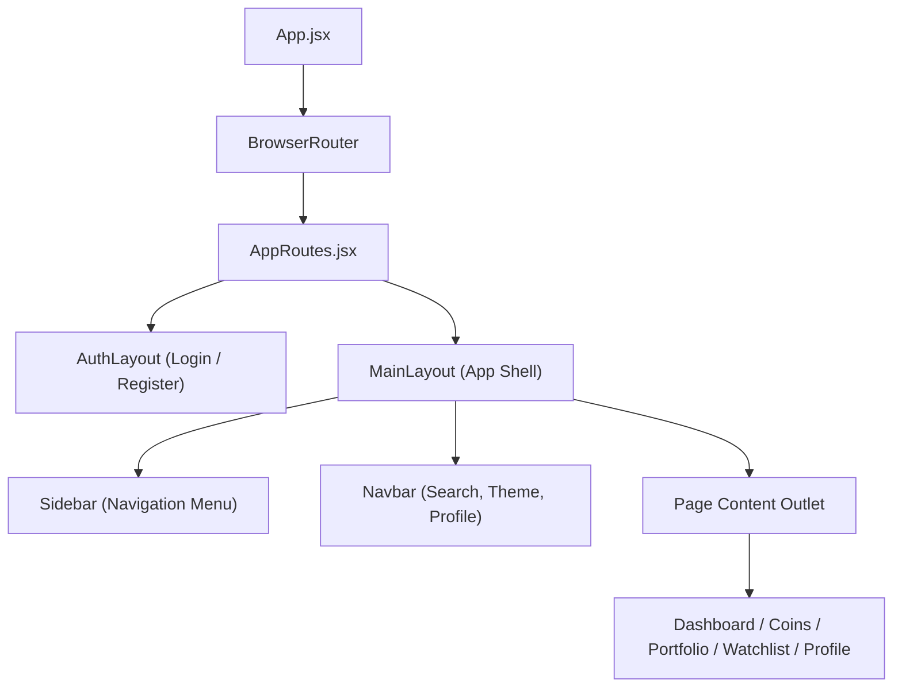
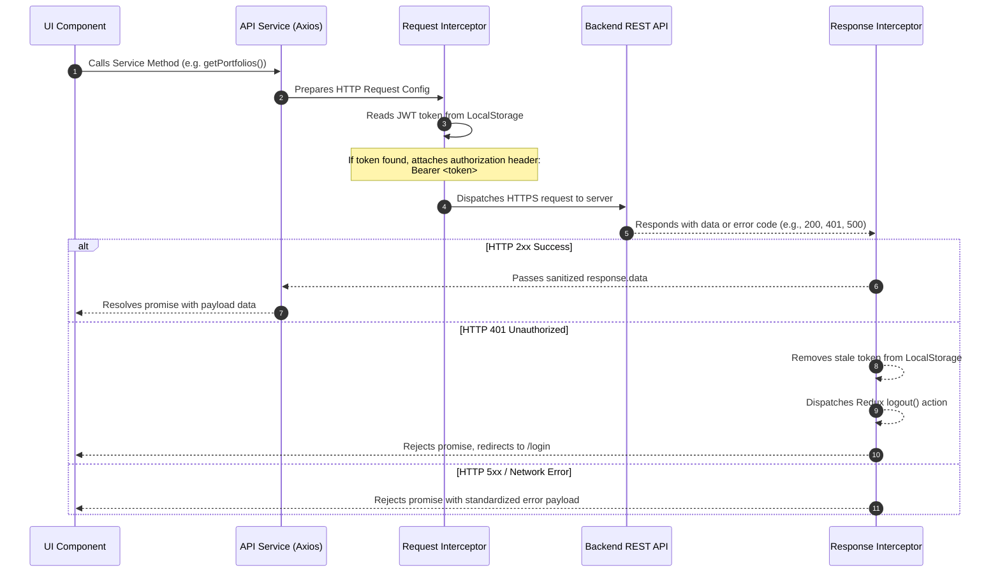
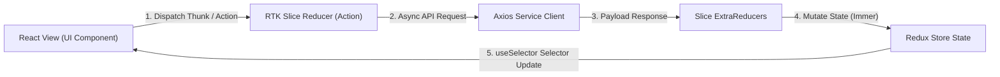
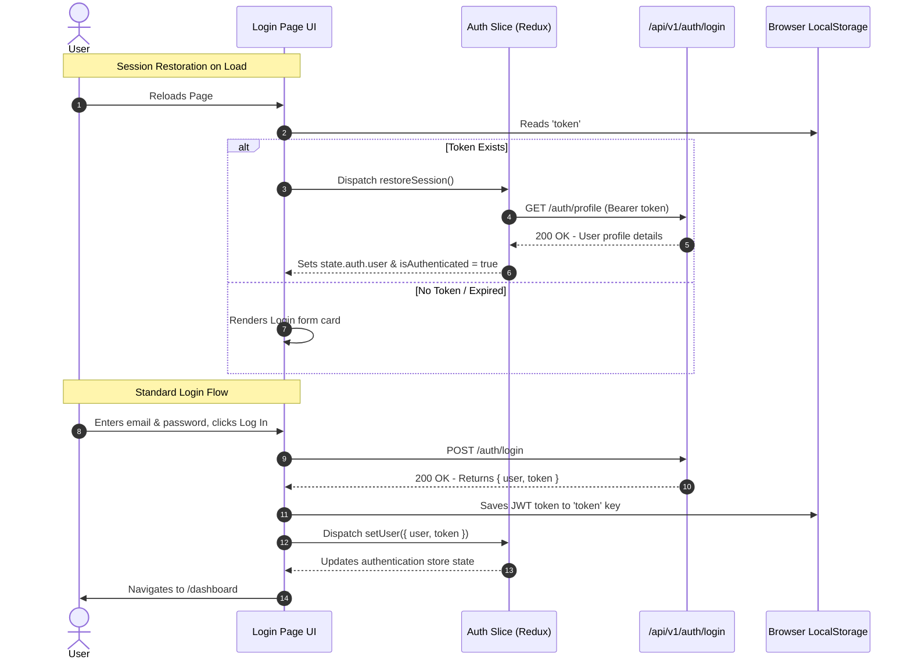

# 🏛️ CryptoVerseX - System Architecture & Workflows

This document outlines the software architecture, global state flows, database interfaces, API client configurations, and core functional lifecycles of the CryptoVerseX application.

---

## 🎨 1. Frontend Architecture

The frontend is structured as a client-side Single Page Application (SPA) using React 18, Vite, and React Router v6. It uses a layout-and-page-based composition hierarchy.

### Layout composition

---

## 📡 2. API Layer & Request Lifecycle

The application communicates with a Node.js/Express API. Axios handles outgoing AJAX requests, utilizing interceptors to handle session tokens and error dispatching centrally.

---

## 🗮 3. State Management (Redux Architecture)

The app maintains clean, immutable global state using **Redux Toolkit (RTK)**. Slices isolate business logic domains and coordinate asynchronous side-effects.

### Core Slices:
1. **`auth`**: Manages token strings, current user Profile parameters, login/logout, and session restoration states.
2. **`coins`**: Caches live cryptocurrency indexes, lists, pagination metadata, and search filters.
3. **`watchlist`**: Watches user-bookmarked assets, analytics, and trending listings.
4. **`portfolio`**: Tracks holdings balances, ROI metrics, purchase logs, simulations, and algorithmic asset recommendations.
5. **`ui`**: Stores visual preferences, theme settings (`light`/`dark`), and layout sidebar parameters.

---

## 🔐 4. Authentication Flow

CryptoVerseX uses JWT-based authentication. Sessions are cached in `localStorage` to support persistent logins across browser sessions.

---

## 📊 5. Feature Workflows

### Watchlist Flow
1. User searches/explores coins list on `/coins`.
2. Clicking the **Bookmark** button dispatches a request via `watchlistService.addToWatchlist(coinId)`.
3. The server creates a bookmark record. The local store updates optimistically or via load trigger.
4. The `/watchlist` page fetches all user bookmarks, analytics (e.g. average ROI of watchlisted coins), and trending watchlisted coins.
5. Watchlist renders items in list/grid views with real-time price updates.

### Portfolio Simulation Flow
1. User navigates to `/portfolio`. If no holdings exist, a CTA modal prompts the user to create their first asset entry.
2. Adding a holding prompts the user for a **Coin**, **Quantity**, and **Buy Price**.
3. Adding/modifying items updates MongoDB. The app dispatches parallel calls (`Promise.allSettled`) to load holdings, distribution allocations, and chronological performance curves.
4. **Overview Cards** display calculated total values, profits, ROIs, and best/worst performing tokens.
5. **Recharts Charts** render:
   - Proportional allocation of assets (Pie Chart).
   - Historical investment growth timeline (Area Chart).
6. **Simulators** (Investment Calculator) allow users to pick a historical date and amount to calculate what their investment would be worth today.

### Market Intelligence Flow
1. The **Market Intelligence** systems on `/dashboard` and `/coins` process raw backend datasets using optimized MongoDB aggregation pipelines.
2. In the backend:
   - **Top Gainers/Losers** are resolved using `$sort` on daily return percentages.
   - **Market Dominance & Cap Statistics** are computed using `$group` aggregations.
   - **Volatility Analysis** measures standard deviation over historical datasets.
3. The frontend displays these results on dashboard summary cards, giving users clear, actionable insights into current market trends.
